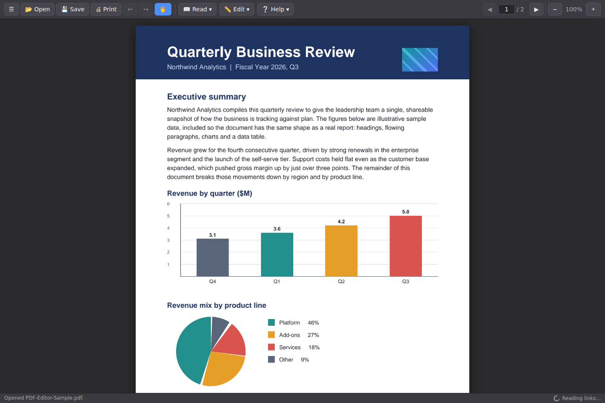
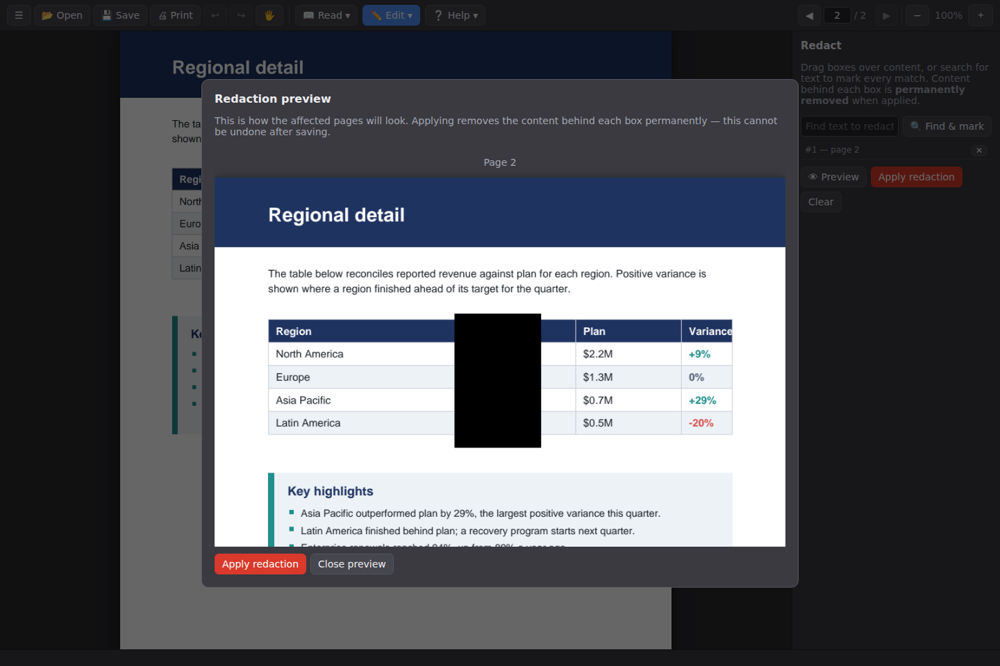
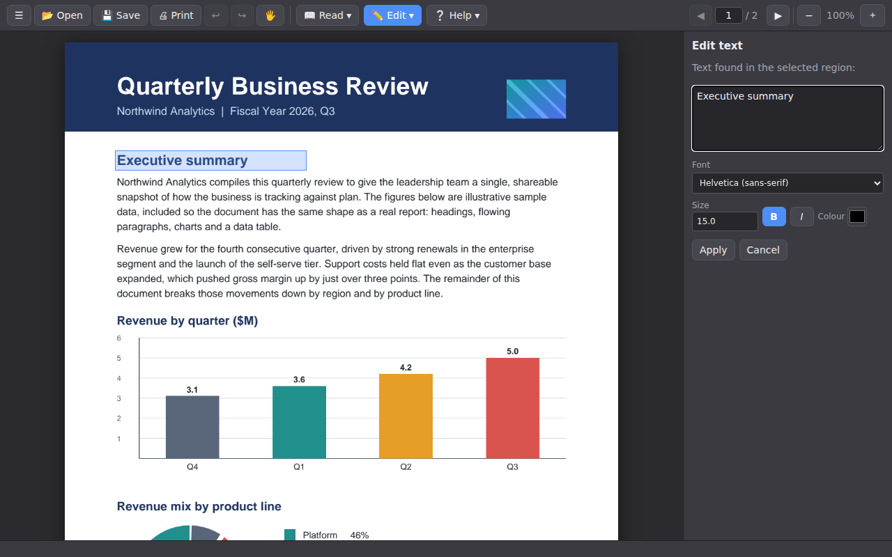
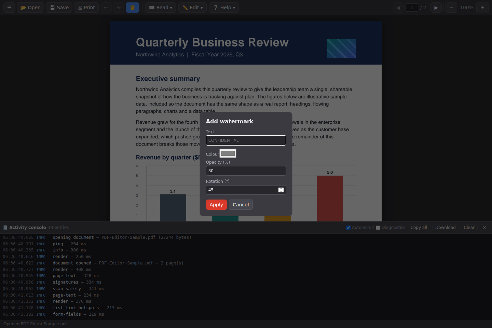
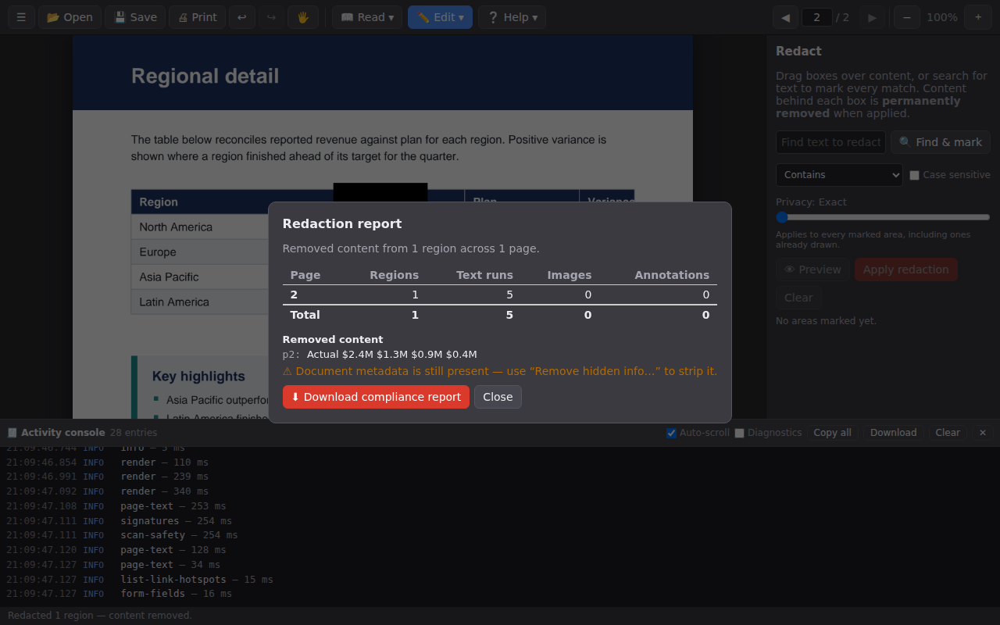

# A Chromium PDF Editor

A free PDF editor extension for Chromium browsers (Chrome, Edge, Brave, Chromium, Opera).
The UI is a Manifest V3 browser extension; all document processing is done in **C#/.NET 8**
by a local [native messaging host](https://developer.chrome.com/docs/extensions/develop/concepts/native-messaging),
so your documents never leave your machine.

## Features

| Feature | Notes |
| --- | --- |
| ✏ **Edit existing text** | Drag a box around text, edit it in place. The original text operators are removed from the file and the new text is stamped into the same region. Includes document-wide find & replace. |
| ⬛ **Redaction** | Draw boxes over anything, or **Find & mark** text (by contains / starts-with / ends-with / whole word, case-insensitive by default). A **preview window** shows the result before you commit. Applying **permanently removes** the content underneath (text operators, image pixels, annotations) — not just covers it — then paints the box. A **Privacy** control defeats the box-length side channel — merge adjacent boxes, round widths, extend to the full line, or add a textured fill — set globally or per area. A downloadable **compliance report** lists what was removed per page and per region (with the removed text and image thumbnails) and flags any JavaScript or metadata that redaction leaves behind. |
| 💾 **Save changes** | Save the edited document via the file picker or the downloads bar. Undo history while editing. |
| 🧭 **Sits on top of browser PDF viewing** | Navigating to a `.pdf` opens the editor automatically (toggleable). Embedded PDF viewers on web pages get an “Edit in PDF Editor” overlay button, plus a toolbar button and right-click menu. Adobe sites and viewers are always left alone. |
| 🔒 **Password protection** | AES-256 encryption with user/owner passwords; open, edit, and decrypt protected files. |
| 🖼 **Open images** | Open a PNG/JPEG/etc. directly — with the Open button or by **dragging it onto the window** — and it becomes a one-page PDF you can edit, OCR and merge like any document. |
| ➕ **Merge & arrange** | Append PDFs, images, or Word documents; a **Merge & arrange** dialog lets you set the combine order (or drop files) before merging. Images are laid onto standard A4 pages. |
| 🗂 **Organize pages** | Reorder pages by drag or ▲/▼ and delete the ones you don't need. |
| 🗒 **Fillable forms** | Insert text, multi-line, checkbox, dropdown (choice), and JavaScript **button** fields others can fill in, and fill/flatten existing AcroForm fields. |
| 🖍 **Annotate** | Highlight text, draw freehand, and add text anywhere. |
| ✥ **Move text & images** | Grab a run of text or an image with the Move tool and drag it to a new position. |
| 🖱 **Right-click menu** | Context actions: on selected text — Edit, Redact, Highlight, Copy, Open link; on blank page — Make searchable (OCR), Show source code, Save, Print, Zoom, Undo/Redo. |
| ⚙ **Interactive JavaScript** | Add document-level scripts in a small code editor for form calculations/validation (runs in Acrobat/Chrome, never inside the viewer). |
| ▦ **Flatten** | Bake interactive layers into static page content, with a choice of scope: form fields to their appearances, markup/comment annotations to the page, or everything. |
| 🧹 **Remove hidden information** | Scan for and strip metadata, embedded attachments, scripts/actions, comments, bookmarks, and hidden layers before sharing. |
| 🧾 **Activity console** | A dockable log of every action, its timing and any error. An opt-in **Diagnostics** mode adds environment and transfer-size detail and a one-click log download for bug reports. |
| ℹ **About** | Shows the version, build commit and browser — handy for bug reports. |
| 🔀 **Compare versions** | Word-level diff against another version, with a per-page summary of added and removed text. Click a changed page to **jump** to it, or open a rendered **visual (pixel) diff** — added content in red, removed in blue — which catches changes text extraction misses (moved images, scans, spacing). |
| 💧 **Watermark** | Stamp text (e.g. *CONFIDENTIAL*) diagonally across every page, with colour, opacity and rotation. Baked into the page content, not a removable annotation or layer. |
| 🔢 **Bates numbering** | Stamp sequential, zero-padded identifiers (e.g. `ACME000001`) into a page corner — prefix, start number, digit count, suffix and position all configurable. |
| 🔎 **OCR** | Turn a scanned document into searchable, selectable text. Requires Tesseract — see [Optional external tools](#optional-external-tools). |
| 🖋 **Electronic signatures** | Draw a signature on a pad (or upload an image) and place it anywhere; or apply a cryptographic **digital signature** from a PKCS#12 certificate — the editor can also generate a self-signed certificate for you. Signature validity is verified and shown in the status bar. |

## Screenshots

Below, the editor working on a generated [sample document](docs/sample/PDF-Editor-Sample.pdf).
The full gallery — and the scripts that regenerate both the sample and every screenshot — is in
[`docs/`](docs/README.md).

| | |
| --- | --- |
|  |  |
| *Text, charts and images render together.* | *Redaction shows exactly what will be permanently removed.* |
|  |  |
| *Edit existing text in place — font and size are recovered.* | *Strip metadata and other hidden data before sharing.* |
|  |  |
| *Stamp a watermark across every page.* | *An auditable redaction report of exactly what was removed.* |

## Optional external tools

Most features work out of the box. Two optional capabilities shell out to a tool you install
separately on the machine that runs the native host; when the tool is absent the editor reports a
clear, actionable message instead of failing silently.

| Capability | Needs | Install |
| --- | --- | --- |
| **OCR** (Make searchable) | [Tesseract OCR](https://tesseract-ocr.github.io/) + a language pack | Linux: `sudo apt install tesseract-ocr tesseract-ocr-eng` · macOS: `brew install tesseract` · Windows: `winget install -e --id tesseract-ocr.tesseract` |
| **Merging Word documents** | [LibreOffice](https://www.libreoffice.org/) (the `soffice` command) | Linux: `sudo apt install libreoffice` · macOS: `brew install --cask libreoffice` · Windows: the LibreOffice installer |

The host looks for each tool on `PATH` and in the usual install locations. After installing, restart
the browser (so the native host is respawned) and the capability lights up automatically.

## Architecture

```
┌───────────────────────────── Chromium browser ─────────────────────────────┐
│  content.js ──── overlay button on built-in/embedded PDF viewers           │
│  background.js ─ intercepts *.pdf navigation, context menus, toolbar       │
│  viewer.html/js ─ toolbar UI, page canvas, region drawing, preview modal   │
│        │  chrome.runtime.connectNative (JSON, 4-byte LE framing, chunked)  │
└────────┼────────────────────────────────────────────────────────────────────┘
         ▼
  PdfEditor.NativeHost (C# console app, stdio)
         │ dispatch (MessageProcessor, ChunkAssembler)
         ▼
  PdfEditor.Core (C# class library)
    ├─ Redactor / ContentStreamEditor  — true content removal
    ├─ TextTools                       — region text read/replace, find & replace
    ├─ Merger, Encryptor, Signer, CertificateFactory
    └─ PageRenderer (PDFium)           — page PNGs for the viewer
```

The host is **stateless**: every request carries the document as base64 and returns the
transformed document. Host→browser responses over Chrome's 1 MB limit are split into
chunk frames and reassembled by the extension (and vice versa for large requests).

### How redaction really removes content

`ContentStreamEditor` re-parses the page content stream and rewrites it operator by
operator:

- **Text** — every text-showing operator (`Tj`, `TJ`, `'`, `"`) is re-emitted in `TJ`
  form with per-glyph granularity: glyphs inside a redaction region are replaced by an
  equivalent-width kerning displacement, so the hidden text is gone from the file while
  surrounding words keep their exact positions.
- **Images** — image XObjects fully inside a region are dropped; partially covered
  images are decoded, their covered pixels painted black, and re-encoded (the original
  pixel data is destroyed). Inline images touching a region are dropped.
- **Form XObjects** — recursively edited on a cloned copy with the regions transformed
  into form space, so shared forms on other pages are unaffected.
- **Annotations** — links/widgets intersecting a region are removed.

Then an opaque black box is painted on top. Text extraction on the output confirms the
content is unrecoverable — that's exactly what the test suite asserts.

## Building

Requires the [.NET 8 SDK](https://dotnet.microsoft.com/download/dotnet/8.0).

```bash
dotnet build            # build everything
dotnet test             # the whole .NET suite (652 tests: 470 + 136 unit, 17 integration, 29 perf)
```

- **`PdfEditor.Core.Tests`** — unit tests for the PDF engine (redaction, text editing,
  merge, encryption, signatures, rendering), including hard-to-reach paths like nested
  form XObjects, the recursion depth guard, inline images, low-level `'`/`"` text
  operators, and the pixel-scrubber's decode-failure handling.
- **`PdfEditor.NativeHost.Tests`** — fast in-process unit tests for the JSON dispatcher
  and chunk reassembly (malformed input, unknown actions, every action's happy path,
  large-response chunking), with no process spawning.
- **`PdfEditor.IntegrationTests`** — launches the real host binary and speaks Chrome's
  framed protocol over stdin/stdout end to end: ping, chunked requests/responses, and
  full user workflows (edit → redact → merge → encrypt → sign).

### Code coverage

```bash
./scripts/coverage.sh          # run every .NET test project with coverage, print a summary
./scripts/coverage.sh 90       # same, but fail if line coverage drops below 90%
```

This generates an HTML report at `coverage-report/index.html` (via a repo-pinned
[reportgenerator](https://github.com/danielpalme/ReportGenerator) — `dotnet tool restore`
picks it up from `.config/dotnet-tools.json`, no global install needed). CI runs this on
every push, gated at 90%; current coverage is **96% lines / 99% methods** overall
(`PdfEditor.Core` at 98%, `PdfEditor.NativeHost`'s dispatcher at 100%). The remaining gaps
are deliberately-defensive code that's impractical to hit without corrupting internal
state: an encoding-mismatch fallback in `ContentStreamEditor` for text-extraction edge
cases no known encoder produces, two best-effort certificate-field parsing catches in
`Signer`, and `NativeHost`'s `Program.cs` entry point (exercised as a real process by the
integration tests, which coverage instrumentation can't see across a process boundary).

### Browser end-to-end tests (Playwright)

A Playwright suite loads the actual extension into Chromium, registers the real
native host in the test profile, and drives the viewer UI: open/render, redaction
(preview window + apply, with pixel-level verification of the black box), in-place
text editing, find & replace, merge, encryption, drawn and digital signatures,
save, and undo.

```bash
cd e2e
npm install
npx playwright install chromium   # once
npx playwright test               # 138 tests
```

Alongside the functional scenarios it covers the three states the extension can be in before it
can do any work at all, because each is rendered by different code in a different context (the
viewer's empty state, the options page, and the service worker's toolbar badge):

- `tests/host-missing.spec.js` — launches with **no** host registered anywhere and checks the
  pages say, in as many words, that the native host is not installed, and give the command to
  install it. It refuses to run if a host package is installed system-wide, which would quietly
  turn "no host" into a connected one and pass without testing anything.
- `tests/host-version.spec.js` — checks that a host of the wrong version is flagged rather than
  reported as a healthy connection. The real host answers every message; only the version the
  page compares itself against is overridden, so the probe, the comparison and the rendering are
  all the production ones.

#### Package-install tests

The suites above register the host themselves, into a throwaway browser profile. That proves the
extension and the host talk to each other and says nothing about whether *installing the package*
gives you a working editor — which is a real failure this project shipped: a `.deb` that installed
cleanly, put the host somewhere sensible, and was then never found by the browser.

So there is a second suite, with its own config, that installs the real package with `dpkg` and
drives the extension against whatever it left behind — no profile-local manifest, no locally built
host:

```bash
cd e2e
npx playwright test --config playwright.package.config.js
```

It builds the `.deb` (or reuses one via `PDF_EDITOR_DEB=/path/to.deb`), installs it, runs the
tests, and purges the package again afterwards, pass or fail. Installing needs root, so it uses
`sudo` when you are not already root, and it refuses to run over an existing install rather than
removing a host you use. It works because the extension's manifest `key` pins its ID to the
published Web Store one even when loaded unpacked — the same ID the package writes into
`allowed_origins`.

CI runs it as the `package-install-e2e` job. The `.deb` is the only one of the three Linux
packages an Ubuntu runner can install; the `.rpm` and Arch packages are checked structurally
instead, by `scripts/verify-linux-package.sh`, which reads the same manifest, path and permission
invariants out of each archive.

### Performance guards

A separate test project (`tests/PdfEditor.Perf.Tests`) puts time budgets on the core
operations behind the editor and checks their algorithmic scaling, so a regression that
made something quadratic — or reprocessed the whole document where it shouldn't — fails a
build rather than a user noticing lag.

```bash
dotnet test tests/PdfEditor.Perf.Tests   # absolute-time budgets + scaling checks
```

The budgets are generous backstops (many times the observed local time); the scaling tests
compare small vs large inputs so they hold regardless of machine speed. Set
`PDF_EDITOR_PERF_SLACK` (a multiplier, e.g. `3`) to relax every budget uniformly on a slow
host — CI runs this project as its own `perf` job with extra slack. It is intentionally
outside the coverage-gated projects so timing runs never affect the coverage number.

### CI on pull requests

Every push and PR runs `.github/workflows/ci.yml`'s jobs: `test` (build + full
.NET suite with the 90% coverage gate), `perf` (the performance guards above),
`e2e` (the Playwright suite, headless), `package-install-e2e` (builds the `.deb`, installs it,
and drives the extension against the packaged host), and `package-dry-run` (actually runs
`scripts/package-extension.sh` and uploads the resulting zip). That last job exists because the release pipeline below
(`release-candidate.yml`, `release-extension.yml`) only triggers on merges to `main` or
published Releases — without a PR-time dry run, a regression in the packaging script
itself would only surface once someone actually tried to cut a release.

## Release cycle: release candidates → promotion

Releases go through two stages, each gated on the full .NET test suite passing —
nothing is packaged or deployed if `dotnet test` fails.

**1. Every merge to `main` creates a release candidate**
(`.github/workflows/release-candidate.yml`). It builds and tests the solution, computes
the next version by bumping the patch number of the latest *final* release tag —
ignoring other RCs, so they never inflate the version — then creates and pushes a tag
`vX.Y.Z-<build>` (`<build>` is the GitHub Actions run number, e.g. `v1.0.1-57`) and an
empty **prerelease** for it. Creating that prerelease triggers stage 2.

**2. `release-extension.yml`** runs for *every* published Release — both the
auto-created RC prereleases and manually-promoted final releases — and does the actual
build/test/package/publish work:

1. **`verify`** — builds and runs the full .NET test suite. Nothing downstream runs if
   this fails.
2. **`package`** — stamps `extension/manifest.json`'s version from the release's tag
   (an RC tag `v1.0.1-57` becomes manifest version `1.0.1.57` — Chrome allows up to four
   dot-separated parts — a final tag `v1.0.1` stays `1.0.1`), packages via
   `scripts/package-extension.sh`, uploads the zip as a build artifact, and attaches it
   to the Release that triggered the run.
3. **`publish-to-chrome-web-store`** — deploys to the Chrome Web Store, **but only when
   the Release is not a prerelease**. Release candidates always stop at step 2; nothing
   from `release-candidate.yml` ever reaches the store on its own.

**To promote a release candidate**: pick a known-good RC (its GitHub Release links back
to the commit it was built from), then create a new Release targeting that same commit
with a clean tag — `v1.0.1`, no `-<build>` suffix — and leave "Set as a pre-release"
unchecked. `release-extension.yml` refuses to deploy an RC-style tag if it isn't marked
as a prerelease, so a mistagged promotion fails loudly instead of shipping the wrong
version.

`scripts/package-extension.sh` (used by both workflows, and manually if you want) builds
a Chrome Web Store-ready zip: it (re)generates the icons, validates
`extension/manifest.json`, and zips `extension/` so `manifest.json` sits at the zip's
root (the format the store requires) rather than nested in a folder.

```bash
./scripts/package-extension.sh          # writes dist/pdf-editor-extension-v<version>.zip
```

`release-extension.yml` can also be run manually via *Run workflow* (`workflow_dispatch`)
for ad hoc packaging, with an option to force a Chrome Web Store upload.

### Enabling automatic Chrome Web Store publishing (optional)

Automatic publishing needs a one-time setup, since the store's API is OAuth-based and
tied to your developer account:

1. Create/identify the item in the [Developer Dashboard](https://chrome.google.com/webstore/devconsole)
   and note its **extension ID**.
2. Follow Google's [API setup guide](https://developer.chrome.com/docs/webstore/using_webstore_api/)
   to create OAuth client credentials and obtain a refresh token (the
   [`chrome-webstore-upload-cli`](https://github.com/fregante/chrome-webstore-upload-keys)
   `generate-tokens` helper automates the OAuth dance).
3. Add these as repository secrets (Settings → Secrets and variables → Actions), ideally
   scoped to a `chrome-web-store` [environment](https://docs.github.com/en/actions/deployment/targeting-different-environments/using-environments-for-deployment)
   with required reviewers for extra safety before publishing:
   - `CHROME_EXTENSION_ID`
   - `CHROME_CLIENT_ID`
   - `CHROME_CLIENT_SECRET`
   - `CHROME_REFRESH_TOKEN`

Without these secrets, everything else in the pipeline still works — you just upload the
built zip by hand the first time (which Chrome requires anyway, to create the listing).

## Installing

### Easiest: the all-in-one bundle (no .NET SDK)

Every [release](../../releases) attaches `pdf-editor-bundle-<platform>.zip` for each desktop
platform. It contains the extension, the matching self-contained native host, and the install
script — everything in one download. Unzip it and follow the included `INSTALL.md`:

1. `chrome://extensions` → *Developer mode* → *Load unpacked* → select the `extension/`
   folder. Note the extension ID.
2. Register the host (auto-detects the bundled `host/`):
   `./scripts/install-host.sh <extension-id>` (Linux/macOS) or
   `powershell -NoProfile -ExecutionPolicy Bypass -File .\scripts\install-host.ps1 -ExtensionId <extension-id>`
   (Windows — see [why the policy flag](#why-these-commands-set-an-execution-policy)).
3. Restart the browser.

### System-wide: the OS installer packages (`.deb` / `.rpm` / Arch / `.msi`)

Every [release](../../releases) also attaches native-host installer packages that put the
self-contained host under `/opt/pdf-editor-host` (Linux) or *Program Files* (Windows) and
register it **system-wide** for Chrome, Chromium, Edge, Brave, Vivaldi, and Opera — including
their beta and dev channels. They only install the **native host** — you still get the extension
from the Chrome Web Store.

```bash
sudo apt install ./pdf-editor-host_<version>_amd64.deb          # Debian / Ubuntu
sudo dnf install ./pdf-editor-host-<version>-1.x86_64.rpm       # Fedora / RHEL / openSUSE
sudo pacman -U ./pdf-editor-host-<version>-1-x86_64.pkg.tar.zst # Arch
# Windows: double-click the .msi, or  msiexec /i pdf-editor-host-<version>-x64.msi
```

Each of these packages also gives you a way to check the host independently of any browser — this
is the first thing to try if the extension says the host is unavailable. On Linux the package puts
the host on your `PATH`; on Windows it lands next to the installed files:

```bash
pdf-editor-host --diagnostics     # Linux: prints version, runtime, OS and whether OCR is available
```

```powershell
# Two roots, because both hold real installs: an MSI built before the `-arch x64` fix was a 32-bit
# package, which Windows Installer redirects to "C:\Program Files (x86)".
$hostDir = "$env:ProgramFiles\PDF Editor Host","${env:ProgramFiles(x86)}\PDF Editor Host" |
  Where-Object { Test-Path $_ } | Select-Object -First 1
& "$hostDir\PdfEditor.NativeHost.exe" --diagnostics   # Windows
```

#### Re-registering per-user (Windows)

The MSI writes machine-wide (`HKLM`) registry values pinned to the Web Store extension ID. It also
installs `register-host.ps1` beside the host, which writes per-user (`HKCU`) values instead —
Chromium reads `HKCU` first, so this overrides the MSI's registration without disturbing it. That
is what you need for a developer-mode extension, whose ID is different:

```powershell
$hostDir = "$env:ProgramFiles\PDF Editor Host","${env:ProgramFiles(x86)}\PDF Editor Host" |
  Where-Object { Test-Path $_ } | Select-Object -First 1
$reg = "$hostDir\register-host.ps1"
powershell -NoProfile -ExecutionPolicy Bypass -File $reg -ExtensionId <your-extension-id>
powershell -NoProfile -ExecutionPolicy Bypass -File $reg -List        # show what it would write
powershell -NoProfile -ExecutionPolicy Bypass -File $reg -Uninstall   # drop the per-user values
```

##### Why these commands set an execution policy

Every PowerShell command in this README launches the script through
`powershell -NoProfile -ExecutionPolicy Bypass -File <script>` rather than invoking it directly as
`.\register-host.ps1` or `& "...\register-host.ps1"`. Windows *client* editions ship with the
execution policy set to `Restricted`, which refuses to run **any** `.ps1` file — so the direct form
fails for most users with `cannot be loaded because running scripts is disabled on this system`,
before a single line of the script executes. `-NoProfile` additionally keeps a user's profile
script from changing what the registration sees.

The flag only relaxes the policy for that one child process; it does not change the machine's
setting. If your organisation enforces the policy through Group Policy, `-ExecutionPolicy Bypass`
is ignored by design — ask an administrator, or run the equivalent registry commands by hand with
`register-host.ps1 -List` as the reference for what they should contain.

Unlike Linux, there are no per-channel registry keys to worry about: the key a Chromium build reads
on Windows is a compile-time constant with no channel in it, so Chrome Beta, Dev and Canary all read
the same `SOFTWARE\Google\Chrome\NativeMessagingHosts` key that stable does.

#### Snap and flatpak browsers

A snap- or flatpak-packaged browser runs sandboxed and **cannot see `/etc`**, so the system-wide
registration never reaches it. The packages ship a helper that registers the host inside your own
user (and sandbox) configuration instead:

```bash
pdf-editor-host-register          # registers for every browser this user has, snap/flatpak included
pdf-editor-host-register --list   # show where it would write, without writing
```

For a flatpak browser you also have to let it reach the host binary, once:

```bash
flatpak override --user --filesystem=/opt/pdf-editor-host:ro com.google.Chrome
```

Only `/opt` is granted, and the manifest `pdf-editor-host-register` writes for a flatpak browser
names `/opt/pdf-editor-host/PdfEditor.NativeHost` rather than the `/usr/bin/pdf-editor-host`
symlink every other browser gets. Flatpak reserves `/usr` (along with `/etc`, `/app`, `/dev` and
`/proc`): the sandbox has its own, `flatpak override --filesystem=/usr/bin/pdf-editor-host` is
refused with `Path "/usr" is reserved by Flatpak`, and even `--filesystem=host` puts the host
system's `/usr` under `/run/host/usr`. A flatpak browser simply does not have
`/usr/bin/pdf-editor-host` to launch.

#### If the host still isn't picked up

The extension's options page tells you *which* of the three things went wrong and what to do
about it, because the browser's own message (`Specified native messaging host not found.`) is the
same for all of them:

| What the options page says | What it means | Fix |
| --- | --- | --- |
| not installed for this browser | no manifest in any directory this browser reads | install the package for your distro; for a snap/flatpak browser run `pdf-editor-host-register` |
| does not allow this extension | a host is registered, but its `allowed_origins` names a different extension ID | `pdf-editor-host-register --extension-id <your-extension-id>` (Linux) or `register-host.ps1 -ExtensionId <your-extension-id>` (Windows, via the `powershell -ExecutionPolicy Bypass -File` form below) |
| does not allow this extension, on the **published** build | a *stale per-user* manifest is being read instead of the package's — Chromium reads `~/.config/...` before `/etc`, so an earlier `install-host.sh <old-id>` keeps winning | `pdf-editor-host-register --uninstall` (Linux) or `register-host.ps1 -Uninstall` (Windows), then restart the browser |
| on Windows the host is in `Program Files (x86)`, not `Program Files` | an MSI built before the `-arch x64` fix was a 32-bit package, so Windows Installer redirected it there and put its registry keys under `WOW6432Node` | nothing, unless you want to: the host works there, and every command above finds either root. To move it, uninstall from *Apps & features* and install an MSI built after that fix |
| installed but did not start | the host was launched and exited immediately | run `pdf-editor-host --diagnostics`; a self-contained .NET build needs the system ICU and OpenSSL libraries (`sudo apt install libicu-dev libssl3`) |
| connected, but the host is v*x* and this extension is v*y* | the host connects fine but is from a different release, so anything added since it was built fails or silently does nothing | install the package matching the extension's version (the guidance panel gives the command); if the *extension* is the older half, update it at `chrome://extensions` |

The version check compares major and minor only. A patch or build difference is not flagged — a
banner in front of everyone one hotfix behind is a banner people learn to ignore.

Installing the `.deb`/`.rpm`/Arch package runs the same self-test and prints the same warning, so
a missing runtime library is reported at install time rather than discovered in the browser.

> [!IMPORTANT]
> These packages pin the host's `allowed_origins` to the **published Chrome Web Store
> extension ID** (`ikbkielkpaloojhibinmcfbeekhkdblc`). They work only for the extension
> installed **from the Web Store**, which has that exact ID.
>
> A **developer-mode / unpacked** extension — including one loaded to test the dry-run
> packages built by CI — gets a *different*, machine-specific ID, so the pinned origin will
> not match and the host connection is refused ("Specified native messaging host not found"
> or a rejected connection). Two ways to fix it:
>
> 1. **Re-register per-user** (no rebuild): after installing the package, register the host
>    against your unpacked extension's ID. A per-user manifest takes precedence over the
>    package's system-wide one:
>    ```bash
>    pdf-editor-host-register --extension-id <your-extension-id>   # Linux, from the package
>    ./scripts/install-host.sh <your-extension-id>                 # Linux / macOS, from a checkout
>    ```
>    ```powershell
>    # Windows, from the MSI. Two roots, because an MSI built before the `-arch x64` fix
>    # installs to "C:\Program Files (x86)".
>    $hostDir = "$env:ProgramFiles\PDF Editor Host","${env:ProgramFiles(x86)}\PDF Editor Host" |
>      Where-Object { Test-Path $_ } | Select-Object -First 1
>    powershell -NoProfile -ExecutionPolicy Bypass -File `
>      "$hostDir\register-host.ps1" -ExtensionId <your-extension-id>
>    # Windows, from a checkout or an unzipped bundle:
>    powershell -NoProfile -ExecutionPolicy Bypass -File `
>      .\scripts\install-host.ps1 -ExtensionId <your-extension-id>
>    ```
> 2. **Rebuild the package** pinned to your ID:
>    `CHROME_EXTENSION_ID=<your-extension-id> ./scripts/package-deb.sh` (or
>    `package-rpm.sh` / `package-arch.sh` / `package-msi.ps1`).
>
> Find your unpacked extension's ID at `chrome://extensions` with *Developer mode* on.

### From a source checkout

1. **Generate the icons** (one-time, standard-library Python only — already done if
   you ran a bootstrap script per [CONTRIBUTING.md](CONTRIBUTING.md)):

   ```bash
   python3 scripts/generate-icons.py
   ```
2. **Load the extension**: `chrome://extensions` → enable *Developer mode* →
   *Load unpacked* → select the `extension/` folder. Note the extension ID.
3. **Install the native host**:

   ```bash
   # Linux / macOS
   ./scripts/install-host.sh <extension-id>

   # Windows (PowerShell)
   powershell -NoProfile -ExecutionPolicy Bypass -File `
     .\scripts\install-host.ps1 -ExtensionId <extension-id>
   ```

   By default this **downloads the prebuilt bundle** from the latest [release](../../releases)
   and registers the self-contained host it contains for Chrome, Chromium, Edge, Brave, Vivaldi
   and Opera — no .NET SDK needed. Contributors can add `--from-source` (bash) / `-FromSource` (PowerShell)
   to build the host locally with `dotnet publish`, or `--host-dir`/`-HostDir` to point at an
   already-extracted host.
4. Restart the browser. The extension's options page shows the host connection status.

## Usage notes

- **Redaction preview**: draw boxes with the ⬛ tool, then *Preview* renders the result
  in a window before anything is committed. *Apply* performs the destructive removal.
- **Text editing**: with the ✏ tool, drag around the text you want to change; the editor
  pre-fills what it found there, including the detected font. You can set the replacement
  font family (Helvetica / Times / Courier), size, **bold**/*italic*, and colour before
  applying. The controls default to the region's detected style, so leaving them alone keeps
  the look; font-exact reproduction of arbitrary embedded fonts is not attempted (the
  replacement uses the closest standard font).
- **Sign then don't rewrite**: a digital signature is invalidated by any subsequent
  full rewrite — encrypt **before** signing (the UI warns about this ordering).
- Files opened from `file://` URLs need *Allow access to file URLs* enabled for the
  extension, or just use the 📂 Open button.

## Repository layout

```
extension/                         Chromium MV3 extension (UI)
src/PdfEditor.Core/                PDF engine (iText 9 + PDFium rendering)
src/PdfEditor.NativeHost/          native messaging host executable
tests/PdfEditor.Core.Tests/        unit tests for the PDF engine
tests/PdfEditor.NativeHost.Tests/  unit tests for the JSON dispatcher (in-process)
tests/PdfEditor.IntegrationTests/  process-level protocol & workflow tests
e2e/                               Playwright browser end-to-end tests
scripts/                           bootstrap, packaging, coverage, host-install scripts
.devcontainer/                     dev container definition
```

## Contributing

Setting up a dev environment (dev container or a scripted bootstrap for PowerShell or
Python), the test suites, and PR expectations are covered in
[CONTRIBUTING.md](CONTRIBUTING.md).

## License

GPL-3.0 (see `LICENSE`). Uses [iText Core](https://github.com/itext/itext-dotnet) (AGPL)
and [PDFtoImage](https://github.com/sungaila/PDFtoImage)/PDFium for rendering.
