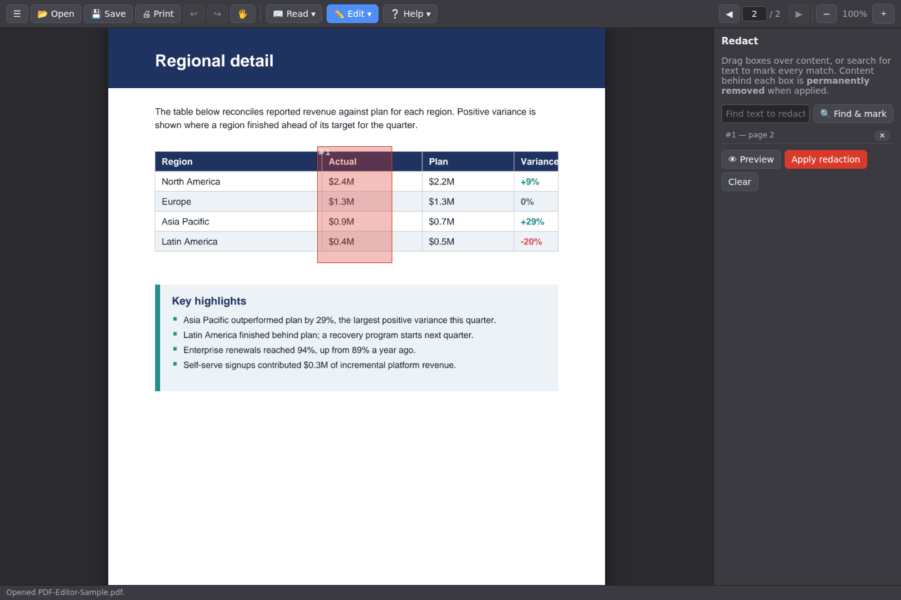
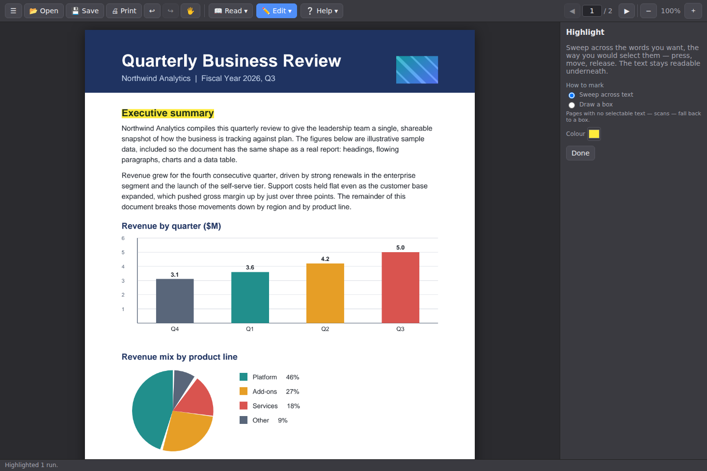
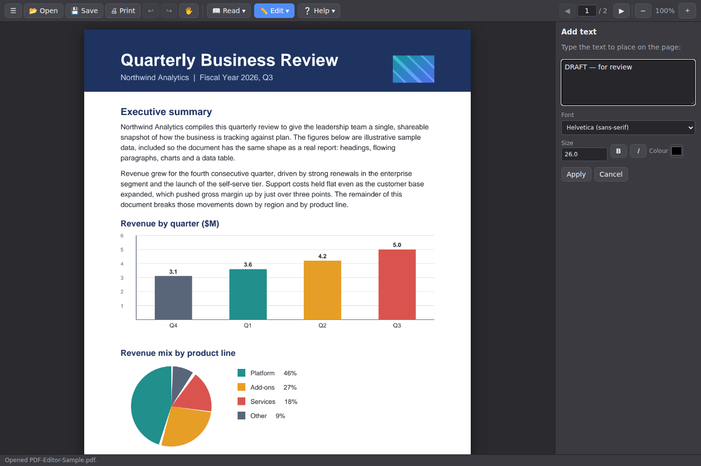
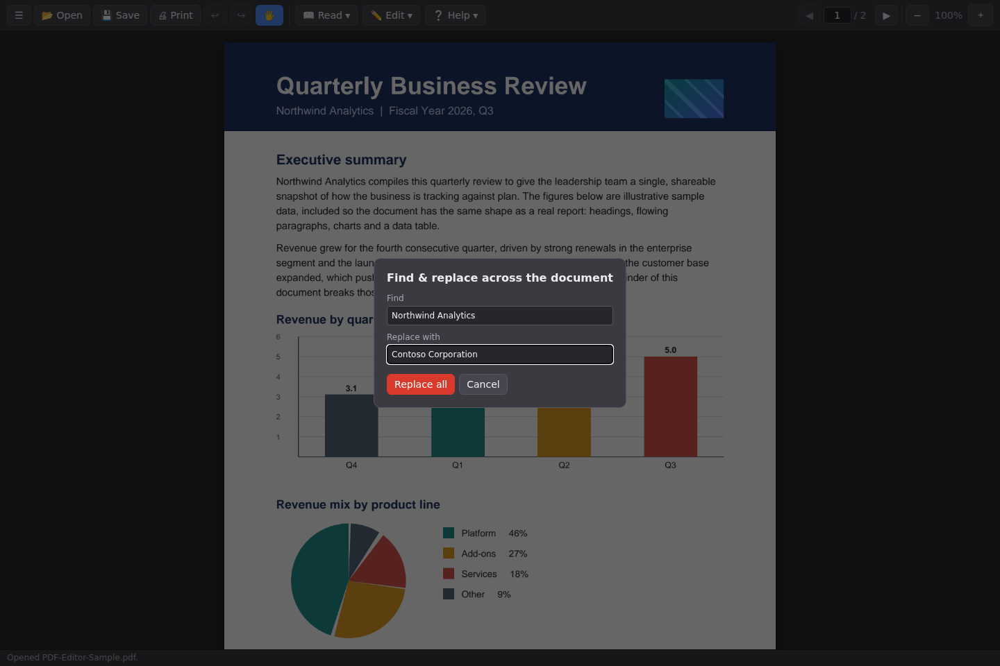
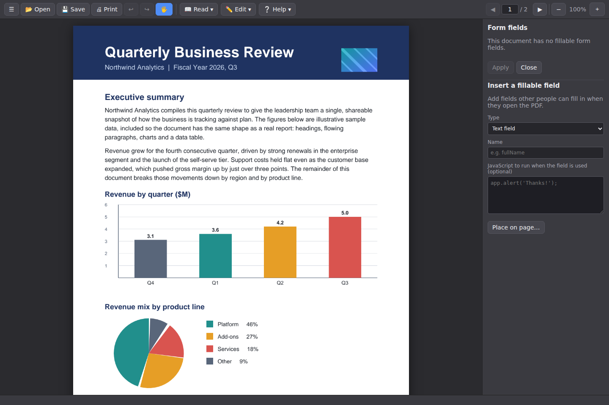
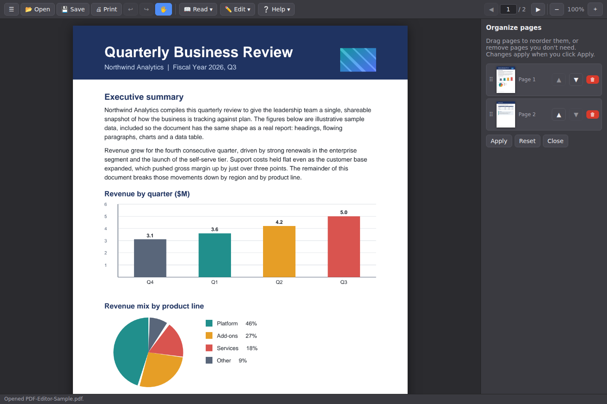
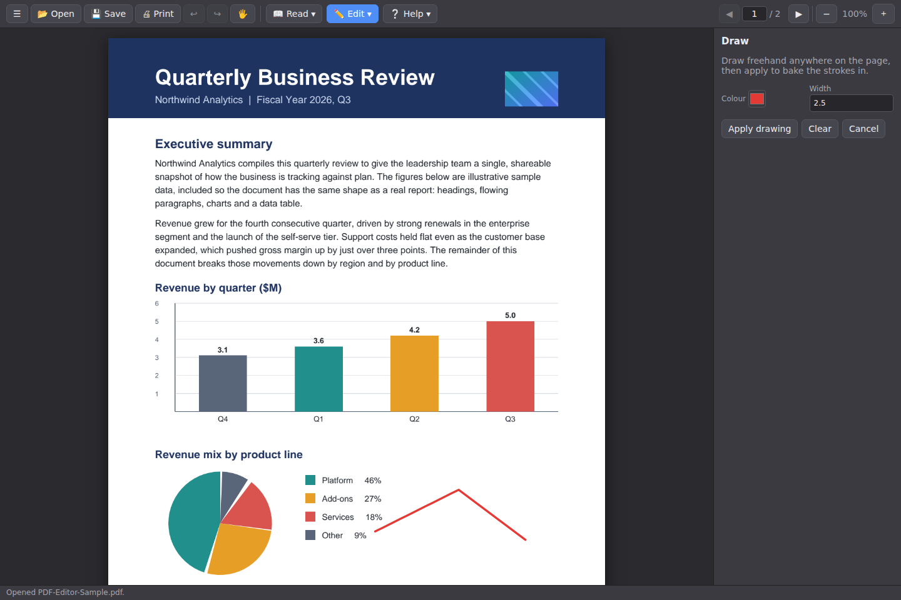
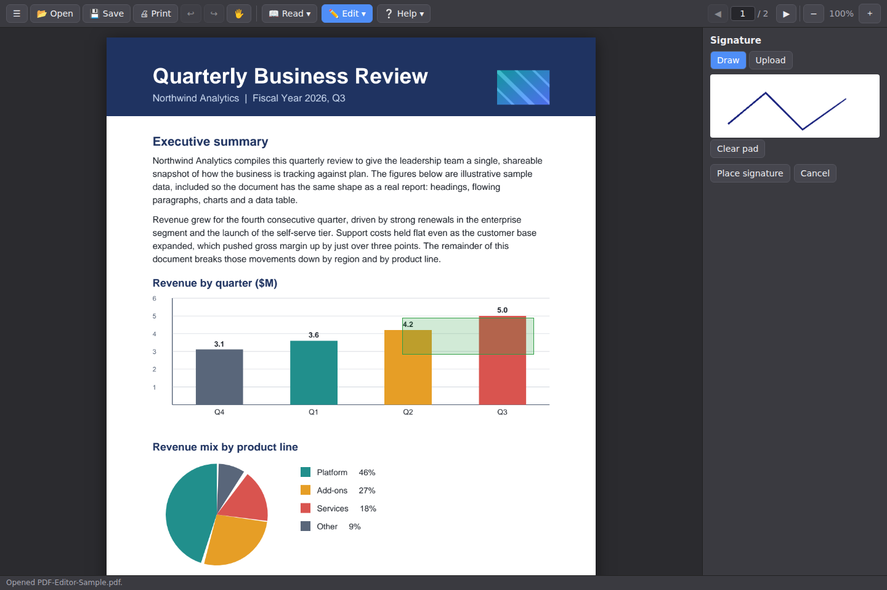
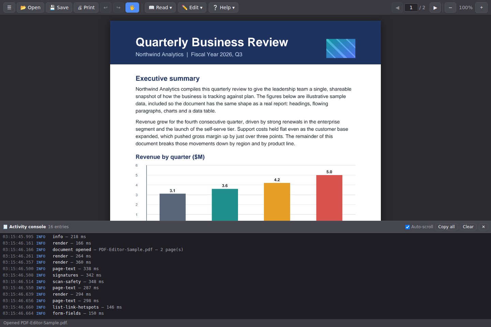

# Documentation assets

This folder holds a sample document and a set of feature screenshots used across the README and
other docs. Everything here is **generated and reproducible** — no manual editing.

## Sample document

[`sample/PDF-Editor-Sample.pdf`](sample/PDF-Editor-Sample.pdf) is a small, realistic two-page
"Quarterly Business Review": a titled cover page with body copy, a bar chart, a pie chart and an
embedded raster logo, followed by a gridded data table and a callout box. It deliberately mixes
flowing text, vector graphics, a real image and hidden document metadata so a single file
exercises the whole editor — redaction, highlighting, inline text editing, move, forms, "remove
hidden information", and the rest.

Regenerate it with:

```bash
node scripts/generate-sample-pdf.mjs
```

## Feature screenshots

Captured by driving the real extension and native host against the sample document. Regenerate
the whole set (this builds the native host and launches Chromium with the extension loaded):

```bash
cd e2e
npm install            # first time only
node scripts/doc-shots.js
```

| Feature | Screenshot |
| --- | --- |
| Open a document — text, charts and images render together |  |
| Redact — mark a region… |  |
| …and preview exactly what will be removed before committing |  |
| Highlight — sweep across text |  |
| Add text anywhere on the page |  |
| Edit existing text in place (font and size are recovered) |  |
| Find & replace across the whole document |  |
| Fillable forms — fill existing fields and build new ones |  |
| Organize pages — reorder or delete |  |
| Remove hidden information before sharing |  |
| Draw freehand |  |
| Electronic signatures — draw or upload, then place |  |
| Activity console — every host action, timing and error |  |
